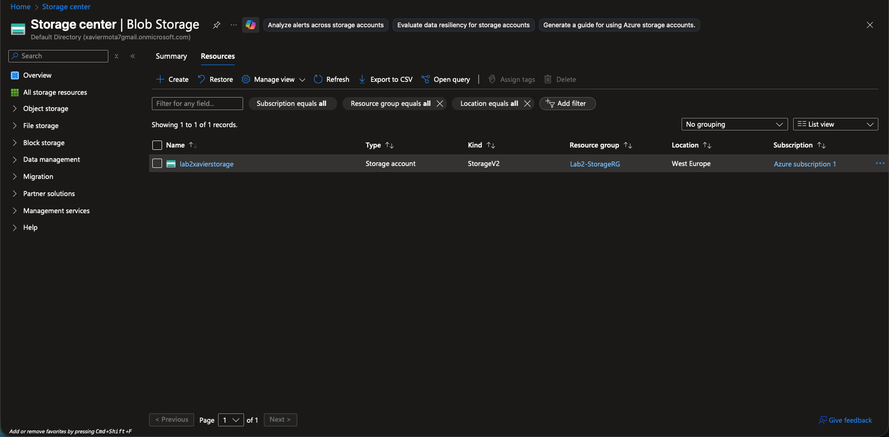
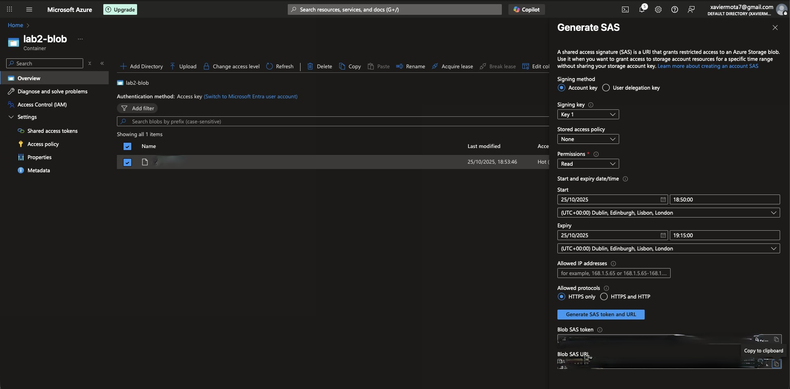
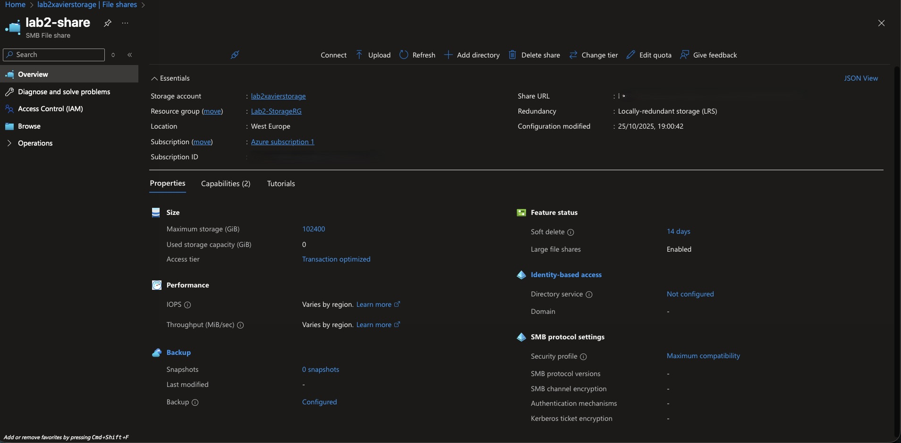
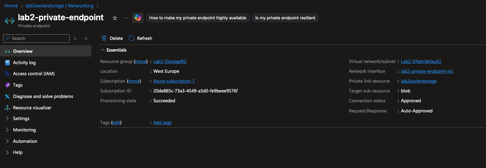
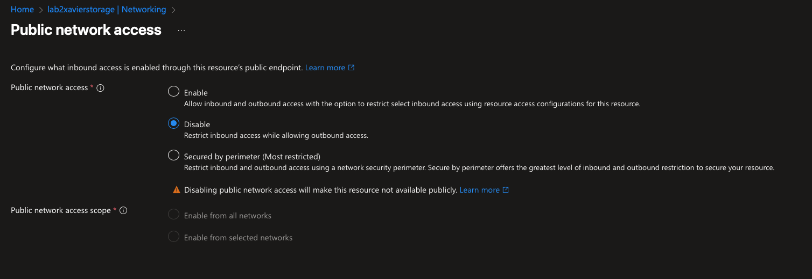
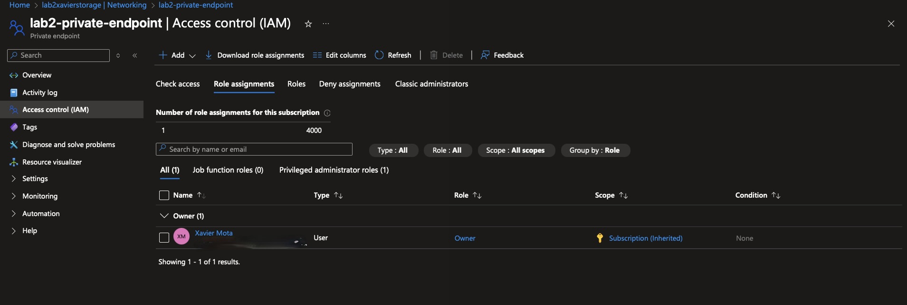

# ☁️ Azure Storage Security & Access Management Lab

## 🎯 Objective
This lab demonstrates how to **secure data in Azure Storage** using private access, network isolation, RBAC, and temporary shared access.  
The goal is to build a **storage environment with restricted access and controlled sharing**, following cloud security best practices.

---

## ⚙️ Environment Setup
**Resource Group:** `Lab2-StorageRG`  
**Region:** `West Europe`  
**Main Resources:**
- Azure Storage Account (`lab2xavierstorage`)
- Blob Container (`lab2-blob`)
- File Share (`lab2-share`)
- Virtual Network (`Lab2-VNet`)
- Private Endpoint
- Role-Based Access Control (RBAC)

---

## 🧩 Steps & Screenshots

### 1️⃣ Resource Group
Resource group created to isolate all resources used in the lab.  

---

### 2️⃣ Storage Account
Standard LRS Storage Account deployed for secure data management.  

---

### 3️⃣ Blob Container 
Private container configured.

---

### 4️⃣ SAS Token
Generated a temporary SAS URL for controlled external access.  
 

---

### 5️⃣ File Share
File share created to simulate internal file access across the network.

---

### 6️⃣ Private Endpoint
Private endpoint configured. Storage now accessible only through `Lab2-VNet`.  

---

### 7️⃣ Public Access Disabled
Public access explicitly disabled to enforce private network only connectivity.  

---

### 8️⃣ Role-Based Access Control (RBAC)
RBAC applied using the **Reader** role for fine grained access management.  

---

## 🔒 Summary
✅ Blob storage secured with private access  
✅ File share implemented for internal use  
✅ SAS Token tested for temporary access  
✅ Private endpoint and VNet isolation configured  
✅ RBAC policies applied for controlled access 

---

## 🧠 Key Skills Demonstrated
- Azure Storage Security  
- Private Networking (VNet + Endpoints)  
- Role-Based Access Control (RBAC)  
- Shared Access Signatures (SAS)   

---

## 👤 Author
**Xavier Mota**  
Microsoft Certified: Azure Fundamentals (AZ-900)  
AZ-104 in Progress | SOC Level 1 Certified  
[LinkedIn](https://linkedin.com/in/xaviermota7) 
